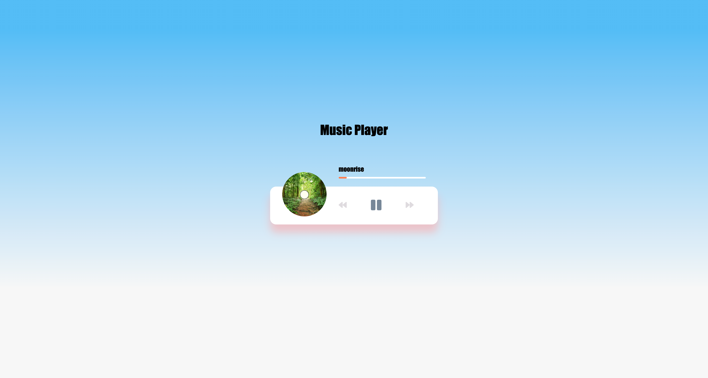

# Music Player

## Table of contents

- [Overview](#overview)
  - [Screenshot](#screenshot)
  - [Links](#links)
  - [Built with](#built-with)
  - [Useful resources](#useful-resources)
- [Author](#author)
- [Questions](#questions)

## Overview

Javascript music player

### Screenshot

### Links

- Live Site URL: [view player](https://jjlindsey.github.io/music-player/)

### Built with

- Javascript
- CSS
- HTML5

### Useful resources

## Author

- Website - [Jennifer Lindsey](https://github.com/JJLindsey)
- Traversy Media - [youtube tutorial](https://www.youtube.com/watch?v=QTHRWGn_sJw&t=1966se)

### *Questions*
If you have any questions, reach out to me on Git Hub https://github.com/JJLindsey, or send me a message jlindsey010@gmail.com.

©Jennifer Lindsey 2021
